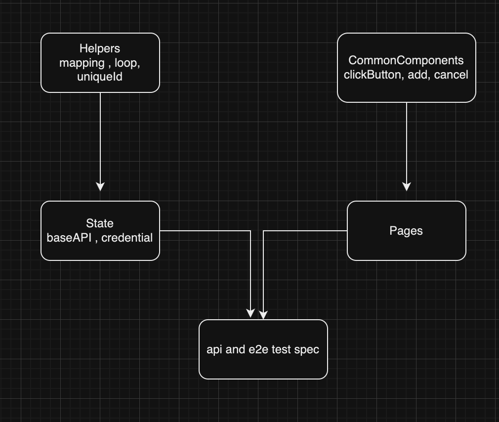

### Demo test use testcafe framework
[Gherkin language syntax](Features)\
[Page object model](src/Pages)\
[API test](src/state)\
[End to end test](src/e2e)\
[GithubCI](.github/workflows/testcafe-workflow.yml)


### Page Object Model

The POM is a recommended standard for front end testing. Deeper dive

[POM Testcafe](https://testcafe.io/documentation/402836/guides/basic-guides/best-practices#use-of-page-objects)

[POM WebdriverIO](https://webdriver.io/docs/pageobjects/)

[POM Selenium](https://www.guru99.com/page-object-model-pom-page-factory-in-selenium-ultimate-guide.html)


### Test Model 
Build as lib and it can trigger and run on CI or local 
....


### Test Structure 



### How to run the test 
Install testcafe
```Javascript
"npm i testcafe"
```
Test CLI 
```Javascript
"npm run test:chrome"
"npm run test:firefox"
```
